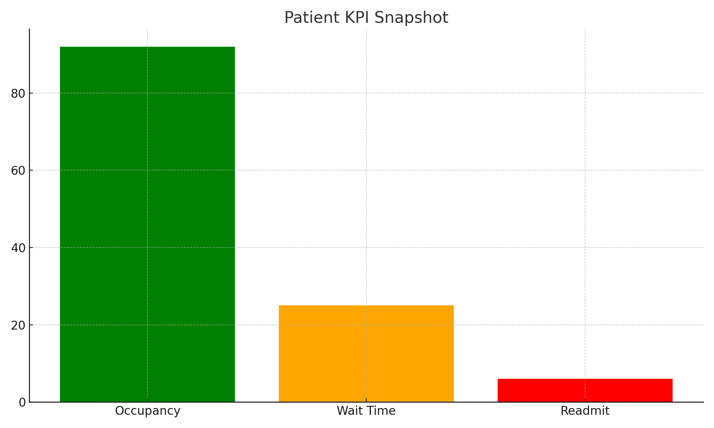

# BI Automation & UAT Validation | Providence Health Care

This project focuses on automating Power BI report refreshes and validating healthcare operational KPIs for monthly executive reporting.

## Tools Used
- Power BI (with Scheduled Refresh)
- SQL Server (views and stored procedures)
- SharePoint (UAT Tracker)
- DAX

## Project Highlights
- Automated daily and monthly dataset refresh schedules
- Linked SharePoint tracker to document UAT feedback and issues
- Built KPI dashboards for hospital performance and patient metrics
- Aligned business users and BI developers for UAT sign-off

## KPI Snapshot

Example of patient KPI visualization used for stakeholder reporting:

## Repo Contents
- `uat_tracker_template.xlsx`: Sample validation workbook used in UAT
- `scheduled_refresh_notes.md`: Documentation of refresh setup
- `powerbi_kpi_snapshot.png`: Visualization sample (anonymized)
- `README.md`: This file

## Outcome
- Cut UAT turnaround time by 50%
- Increased report delivery reliability
- Centralized issue logging with SharePoint integration
